### 4、工程结构


### 5、上报服务系统

#### 5.1、Spring Boot
上报服务系统是一个 Java Web 工程，为了快速开发 web 项目，采用 JavaWeb 最流行的 Spring Boot。

Spring Boot 是一个基于 Spring 之上的快速应用快速构建框架。Spring Boot 主要解决两方面问题：

- 依赖太多问题
    - 轻量级 JavaEE 开发，需要导入大量的依赖
    - 依赖直接还存在版本冲突问题
- 配置太多问题
    - 大量的 XML 配置
    
**开发 Spring Boot 程序的基本步骤:**
   - 导入 Spring Boot 依赖（起步依赖）
   - 编写 `application.properties` 配置文件
   - 编写 `Application` 入口程序
   
#### 5.2、配置 Maven 本地仓库
#### 5.3、导入 Maven 依赖
[pom文件](/report/pom.xml)
[配置文件](/resources/application.properties)

#### 5.4、创建项目包结构

包名 | 说明
---|---
`com.henry.report.controller` | 存放 Spring MVC 的controller 
`com.henry.report.bean` | 存放相关的 Java Bean 实体类
`com.henry.report.util` | 存放相关的工具类

#### 5.5、验证 Spring Boot 工程是否创建成功
**步骤:**
1. 创建 SpringBoot 入口程序 Application
2. 创建`application.properties` 配置文件
3. 编写一个简单的`Spring MVC` Controller/Handler，接收浏览器请求参数并打印回显
4. 打开浏览器测试

**实现:**
1. 创建 SpringBoot 入口程序`ReportApplication`，用来启动 SpringBoot 程序
    - 在类上添加注解
    ```
    @SpringBootApplication
    ```
    - 在 main 方法中添加代码，用来运行 Spring Boot 程序
    ```
    SpringApplication.run(ReportApplication.class);
    ```
2. 创建一个`TestController`
    在该类上要添加注解
    ```java
    @RestController
    public class TestController{
    
    }
    ```
3. 编写一个`test Handler`
    从浏览器上接收一个名为 json 的参数，并打印显示
    ```java
    @RequestMapping("/test")
    public String test(String json){
        System.out.println(json);
        return json;
    }
    ```
 
4. 编写配置文件
    - 配置端口号
    ```properties
       server.port=8888
    ```
5. 启动 Spring Boot 程序
6. 打开浏览器测试 Handler 是否能够接收到数据

[访问连接: http://localhost:8888/test?json=666](http://localhost:8888/test?json=666)

访问结果：


---

#### 5.6、安装 Kafka-Manager

Kafka-Manager 是 Yahool 开源的一款 Kafka 监控管理工具。

**安装步骤:**

1. 下载安装包 [Kafka-Manager下载地址](https://github.com/yahoo/kafka-manager/releases)
    
2. 解压到 `/usr/local/src/` 下
    只需要在一台机器装就可以
    ```bash
    tar -zxvf kafka-manager-1.3.3.7.tar.gz
    ```
    需要编译
   ```bash
   cd kafka-manager-1.3.3.7
   ./sbt clean dist
   ``` 
3. 修改 `conf/application.conf`
    ```bash
    kafka-manager.zkhosts="master:2181,slave1:2181,slave2:2181"
    ```  
    
4. 启动 zookeeper
    ```bash
    zkServer.sh start
    ```
5. 启动 kafka
    ```bash
    ./kafka-server-start.sh ../config/server.properties > /dev/null 2>&1 &
    ```
  


6. 启动 kafka-manager
    ```bash
    cd /usr/local/src/kafka-manager-1.3.3.17/bin
    nohup ./kafka-manager 2>&1 & # 默认启动9000 端口
    nohup ./kafka-manager 2>&1 -Dhttp.port=9900 & # 指定端口
    ``` 
  
  
   页面显示：
 
   
    
    
---

#### 5.7、编写 Kafka 生产者配置工具类

由于项目需要操作 Kafka，所以需要先构建出 KafkaTemplate，这是一个 Kafka 的模板对象，通过它可以很方便的发送消息到 Kafka。

**开发步骤**

1. 编写 Kafka 生产者配置
2. 编写 Kafka 生产者 SpringBoot 配置工具类 `KafkaProducerConfig`，构建 `KafkaTemplate`

**实现**

1. 导入 Kafka 生产者配置文件
	将下面的代码拷贝到`application.properties`中
	
    ```bash
    #
    # Kafka
    #
    #============编写kafka的配置文件（生产者）===============
    # kafka的服务器地址
    kafka.bootstrap_servers_config=master:9092,slave1:9092,slave2:9092
    # 如果出现发送失败的情况，允许重试的次数
    kafka.retries_config=0
    # 每个批次发送多大的数据
    kafka.batch_size=4096
    # 定时发送，达到 1ms 发送
    kafka.linger_ms_config=1
	# 缓存的大小
    kafka.buffer_memory_config=40960
	# TOPOC 名字
	kafka.topic=pyg
    ```
    
2. 编写 `kafkaTemplate`
	```java
	    @Bean   // 2、表示该对象是受 Spring 管理的一个 Bean
    public KafkaTemplate kafkaTemplate() {

        // 构建工程需要的配置
        Map<String, Object> configs = new HashMap<>();

        // 3、设置相应的配置
        // 将成员变量的值设置到Map中，在创建kafka_producer中用到
        configs.put(ProducerConfig.BOOTSTRAP_SERVERS_CONFIG, bootstrap_servers_config);
        configs.put(ProducerConfig.RETRIES_CONFIG, retries_config);
        configs.put(ProducerConfig.BATCH_SIZE_CONFIG, batch_size_config);
        configs.put(ProducerConfig.LINGER_MS_CONFIG, linger_ms_config);
        configs.put(ProducerConfig.BUFFER_MEMORY_CONFIG, buffer_memory_config);


        // 4、创建生产者工厂
        ProducerFactory<String, String> producerFactory = new DefaultKafkaProducerFactory(configs);

        // 5、再把工厂传递给Template构造方法
        // 表示需要返回一个 kafkaTemplate 对象
        return new KafkaTemplate(producerFactory);
    }
	```
	
3. 在`test`测试源码中创建一个Junit测试用例
	- 整合 Spring Boot Test
	- 注入`kafkaTemplate`
	- 测试发送100条消息到`test` Topic
	```java
	@RunWith(SpringRunner.class)
	@SpringBootTest
	public class KafkaTest {

		@Autowired
		KafkaTemplate kafkaTemplate;

		@Test
		public void sendMsg(){
			for (int i = 0; i < 100; i++)
				kafkaTemplate.send("test", "key","this is test msg") ;
			}
		
	}
	```
 
4. 在KafkaManager创建`test` topic，三个分区，两个副本
创建连接kafka集群


创建连接成功


创建topic


创建topic成功


    
5. 启动`kafka-conslole-consumer`
	```bash
	/usr/local/src/kafka_2.11-1.1.0/bin
	./kafka-console-consumer.sh --zookeeper master:2181 --from-beginning --topic test
	```
    运行 test 程序，报错如下：
    
    添加序列化器代码：
    ```java
    // 设置 key、value 的序列化器
    configs.put(ProducerConfig.KEY_SERIALIZER_CLASS_CONFIG , StringSerializer.class);
    configs.put(ProducerConfig.VALUE_SERIALIZER_CLASS_CONFIG , StringSerializer.class);
    ```
   
    
6. 打开kafka-manager的consumer监控页面，查看对应的`logsize`参数，消息是否均匀的分布在不同的分区中
    添加序列化器后重新运行，消费者终端打印消息：
    
    打开页面管理：
    
    消息全落在了一个分区上，这样会影响kafka性能 
    
    解决的最简单的方法：将 "key" 去掉
	```java
	    @Test
    public void sendMsg(){
        for (int i = 0; i < 100; i++)
            kafkaTemplate.send("test","this is test msg") ;
			// kafkaTemplate.send("test", "key","this is test msg") ;
        }
	```
    
    
#### 5.8、自定义分区的实现

    ```java
    public int partition(String topic, Object key, byte[] keyBytes, Object value, byte[] valueBytes, Cluster cluster) {
        // 获取分区的数量
        Integer partitions =  cluster.partitionCountForTopic(topic) ;
        int curpartition = counter.incrementAndGet() % partitions ;  // 当前轮询的 partition 号
        if(counter.get() > 65535){
            counter.set(0);
        }
        return curpartition;
    }
    ```
    
    
    
#### 5.9、上报服务开发
    上报服务系统要能够接收 http 请求，并将 http 请求中的数据写入到 kafka 中。
   
    
    步骤：
    1. 创建`Message`实体类对象
        所有的点击流消息都会封装带 Message 实体类中
    2. 设计一个 Controller 来接收 http 请求
    3. 将 http 请求发送的消息封装到一个`Message`实体类对象
    4. 使用`FastJSON`将`Message`实体类对象转换为JSON字符串
    5. 将JSON字符串使用`KafkaTemplate`写入到`kafka`
    6. 返回给客户端一个写入结果JSON字符串
 
 #### 5.10、模拟生产点击流日志消息到Kafka
    为了方便调试，可以使用一个消息生成工具来生产点击流日志，然后发送个上报服务系统。该消息生成工具可以一次性生产100条
    Clicklog 信息，并转换成 JSON ，通过 HTTPClient 把消息内容发送到编写的 ReportController 上。
   
    
   步骤：
   1. 导入 ClickLog 实体类（ClickLog.java)
   2. 导入点击流日志生成器（ClickLogGenerator.java)
   3. 创建 Kafka 的 Topic（pyg）
   4. 使用 `kafka-console-sonsumer.sh` 消费 topic 中的数据
   5. 启动上报服务
   6. 执行 `ClickLogGenerator`的main方法，生成 100 条用户浏览数据消息发送到 Kafka
   
   实现：
   1. 创建 kafka topic
   ```jshelllanguage
    ./kafka-topics.sh --create --zookeeper master:2181 --replication-factor 2 --partitions 3 --topic pyg
```
   2. 启动消费者
   ```jshelllanguage
    ./kafka-console-consumer.sh --zookeeper master:2181 --from-beginning --topic pyg
```

   运行消息模拟器，运行结果如下（此时，上报服务也是在运行中）：
  
    
    
### 6、Flink 实时数据分析系统开发
   前边已经开发完成了`上报服务系统`，可以通过上报服务系统把电商页面中的点击流数据发送到 Kafka 中。那么，接下来就是开发
   `Flink 实时分析系统`，通过流的方式读取 kafka 中的消息，进而分析数据。
   
   
   **业务**
   - 实时分析频道热点
   - 实时分析频道PV/UV
   - 实时分析频道新鲜度
   - 实时分析频道地域分布
   - 实时分析运营商平台
   - 实时分析浏览器类型
   
   
   **技术**
   - Flink 实时处理算子
   - 使用`CheckPoint`和`水印`解决Flink生产中遇到的问题（网络延迟、丢数据）
   - Flink整合Kafka
   - Flink整合HBase
   
#### 6.1、搭建 Flink 实时数据分析系统 环境

##### 6.1.1 导入Maven项目依赖   

##### 6.1.2 创建项目包结构
包名 | 说明
---|---
`com.henry.realprocess.util` | 存放存放相关的工具类
`com.henry.realprocess.bean` | 存放相关的实体类
`com.henry.realprocess.task` | 存放具体的分析任务，每一个业务都是一个任务，对应的分析处理都写在这里
 
 
##### 6.1.3 导入实时系统Kafka/Hbase配置
 
1. 将`application.conf`导入到`resources`目录
2. 将`log4j.properties`导入到`resources`目录

> 注意修改`kafka服务器` 和`hbase服务器` 的机器名称

##### 6.1.4 获取配置文件API介绍
`ConfigFactory.load()`介绍


常用 API 

  
##### 6.1.5 编写 Scala 读取代码配置工具类
`com.henry.realprocess.util.GlobalConfigutil`
  
#### 6.2 初始化Flink流式计算环境
`com.henry.realprocess.App`


#### 6.3 Flink添加checkPoint容错支持


增量更新的，不会因为创建了很多状态的快照，导致快照数据很庞大，存储到HDFS中。

**实现**：

1. 在Flink流式处理环境中，添加一下`checkpoint`的支持，确保Flink的高容错性，数据不丢失。


#### 6.4 Flink整合Kafka
##### 6.4.1 Flink读取Kafka数据


**实现**：

1、启动上报服务系统 `ReportApplication`
2、启动kafka
3、启动kafka消息生成模拟器
4、启动App.scala

消息生成模拟器发送的消息：

App实时分析系统接收到的消息：

消息者接收到的消息：


##### 6.4.2 Kafka消息解析为元组

步骤：
- 使用map算子，遍历kafka中消费到的数据
- 使用FastJSON转换为JSON对象
- 将JSON的数据解析为一个元组

代码：
1. 使用map算子，将Kafka中消费到的数据，使用FastJSON转换为JSON对象
2. 将JSON的数据解析为一个元组
3. 打印经过map映射后的元组数据，测试能否正确解析
App实时分析系统接收到的消息（Tuple类型）：


##### 6.4.3 Flink封装点击流消息为样例类

**步骤**：
1. 创建一个`ClikLog`样例类来封装消息
2. 使用map算子将数据封装到`ClickLog`样例类


**代码**：
1. 在bean包中，创建`ClikLog`样例类，添加以下字段
    - 频道ID（channelID）
    - 产品类别ID（categoryID）
    - 产品ID（produceID）
    - 国家（country）
    - 省份（province）
    - 城市（city）
    - 网络方式（network）
    - 来源方式（source）
    - 来源方式（browserType）
    - 进入网站时间（entryTime）
    - 离开网站时间（leaveTime）
    - 用户ID（userID）
2. 在`ClikLog`半生对象中实现`apply`方法
3. 使用FastJSON的`JSON.parseObject`方法将JSON字符串构建一个`ClikLog`实例对象
4. 使用map算子将数据封装到`ClikLog`样例类
5. 在样例类中编写一个main方法，传入一些JSON字符串测试是否能够正确解析
6. 重新运行Flink程序，测试数据是否能够完成封装

App实时分析系统接收到的消息（样例类）：
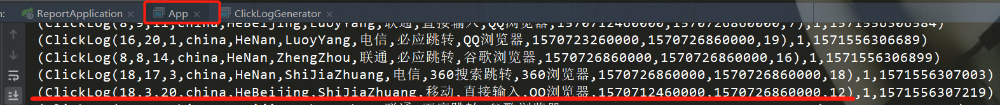


##### 6.4.4 封装KafKa消息为Message样例类


**步骤**：
1. 创建一个`Message`样例类，将ClickLog、时间戳、数量封装
2. 将Kafka中的数据整个封装到`Message`类中
3. 运行Flink测试

App实时分析系统接收到的消息（Message样例类）：
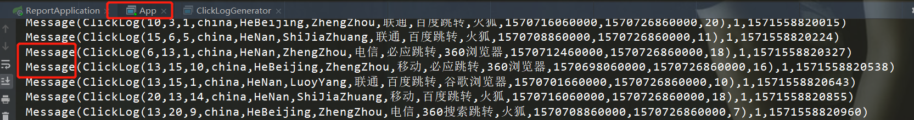

#### 6.5 Flink添加水印支持


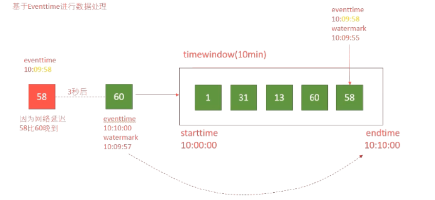


### 7、HBaseUtil 工具类开发
#### 7.1、HBase工具类介绍
前面实现了Flink整合Kafka，可以从Kafka中获取数据进行分析，分析之后，把结果存入HBase
中，为了方便，提前编写一个操作HBase工具类。HBase作为一个数据库面肯定需要进行数据的增删改差，
那么就需要围绕这几个进行开发。
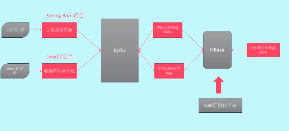

##### 7.1.1、API介绍

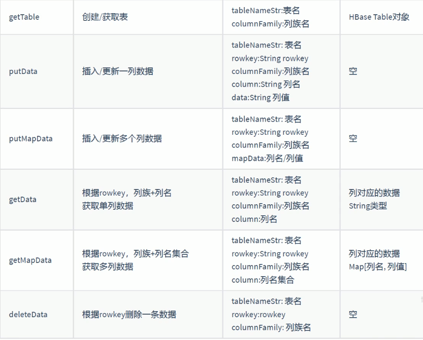

**HBase操作基本类**
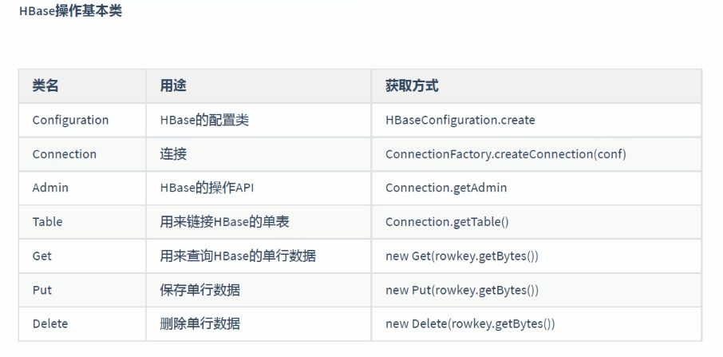


##### 7.1.2、获取表
代码实现添加HBase配置信息
```scala
val conf:Configuration = HBaseConfiguration.create()
```
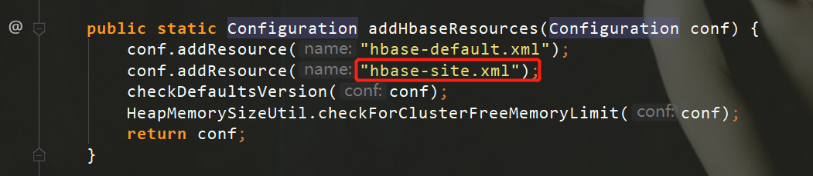

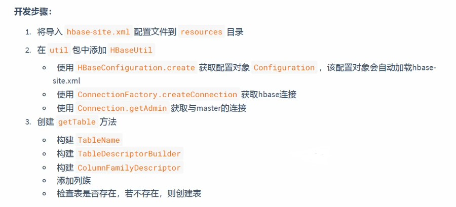

不存在表时，则创建表
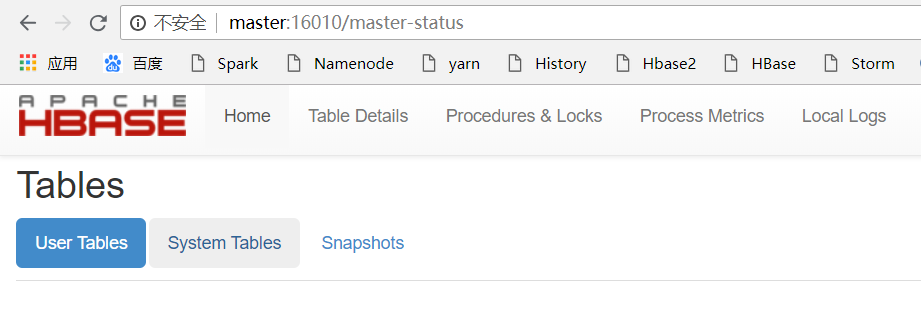
创建后：
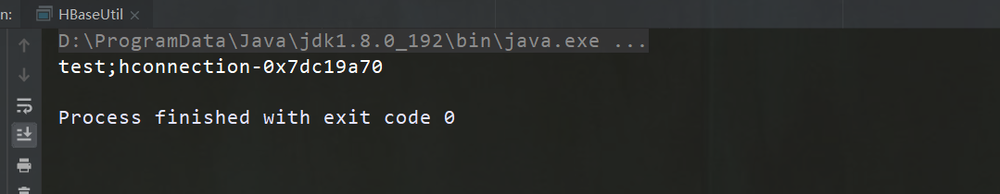
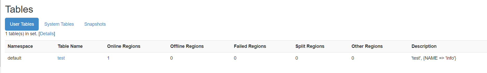


##### 7.1.3、存储数据
创建`putData`方法
- 调用 getTable获取表
- 构建`put`对象
- 添加列、列值
- 对 table 进行 put 操作
- 启动编写 main 进行测试

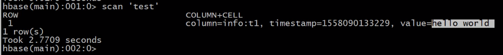


##### 7.1.4、获取数据
1、 使用Connection 获取表
2、 创建 getData 方法
    - 调用 getTable 获取表
    - 构建 get 对象
    - 对 table 执行 get 操作，获取 result
    - 使用 Result.getValue 获取列族列对应的值
    - 捕获异常
    - 关闭表
    
    
##### 7.1.5、批量存储数据
创建 putMapData 方法
    - 调用 getTable 获取表
    - 构建 get 对象
    - 添加 Map 中的列、列值
    - 对 table 执行 put 操作
    - 捕获异常
    - 关闭表
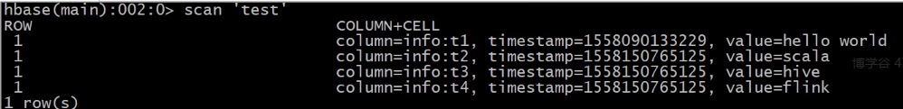


##### 7.1.6、批量获取数据
创建 getMapData 方法
    - 调用 getTable 获取表
    - 构建 get 对象
    - 根据 get 对象查询表
    - 构建可变 Map
    - 遍历查询各个列的列值
    - 过滤掉不符合的结果
    - 把结果转换为 Map 返回
    - 捕获异常
    - 关闭表
    - 启动编写 main 进行测试
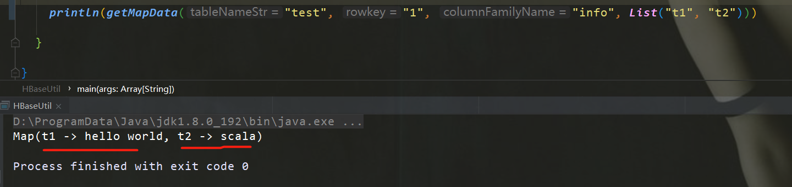


##### 7.1.7、删除数据
创建 deleteData 方法
    - 调用 getTable 获取表
    - 构建 Delete 对象
    - 对 table 执行 delete 操作
    - 捕获异常
    - 关闭表
    - 启动编写 main 进行测试
 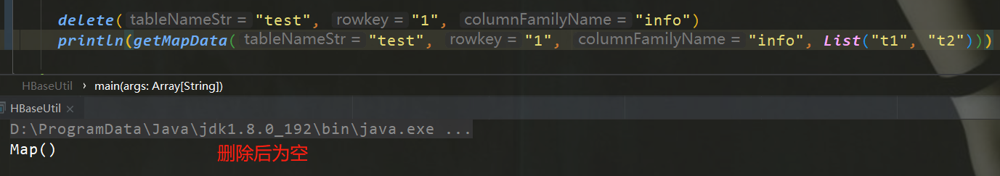
    
   
   
 
 
    
 ### 8、实时数据分析业务目标
 
  

 ### 9、业务开发一般流程
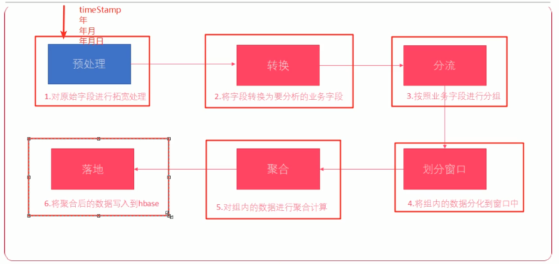

**一般流程**


 ### 10、点击流日志实时数据预处理
 #### 10.1、业务分析
 为了方便后续分析，需要对点击流日志，使用 Flink 进行实时预处理。在原有点击流日志的基础上添加
 一些字段，方便进行后续业务功能的统计开发。
 
 以下为 kafka 中消费得到的原始点击流日志字段：
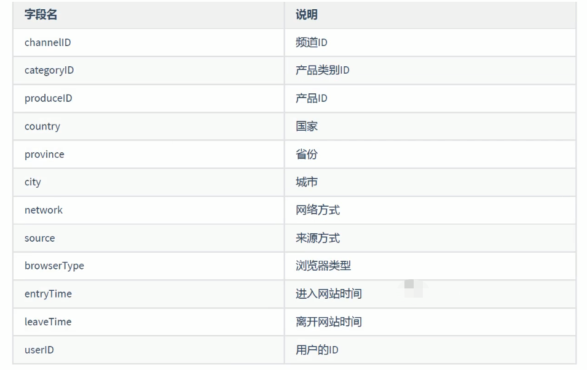

需要在原有点击流日志字段基础上，再添加以下字段：
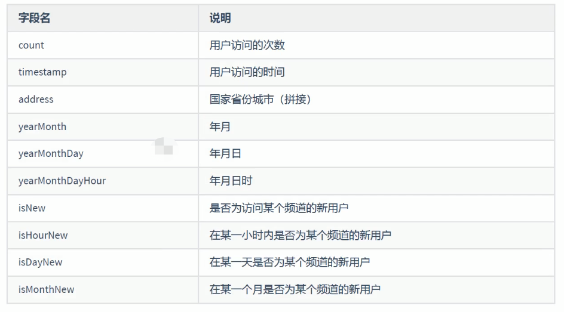

不能直接从点击流日志中，直接计算得到上述后4个字段的值。而是需要在 hbase 中有一个 **历史记录表**
，来保存用户的历史访问状态才能计算得到。
**历史记录表** 表结构：
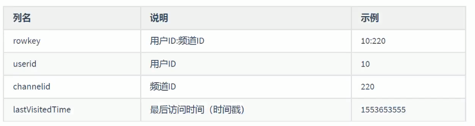


 #### 10.2、创建 ClickLogWide 样例类
 
 使用 ClickLogWide 样例类来保存拓宽后的点击流日志数据。直接**复制**原有的`ClickLog`样例类，
 然后给它额外加上下列额外的字段;
 
 **步骤*
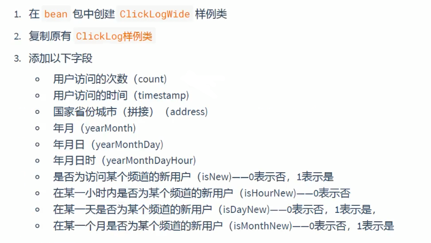
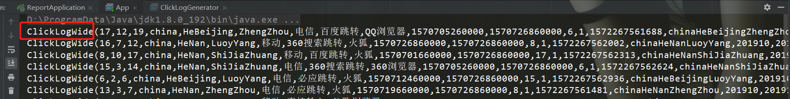


#### 10.3、预处理：isNew字段处理
isNew 字段是判断某个`用户ID`，是否已经访问过`某个频道`。

**实现思路**
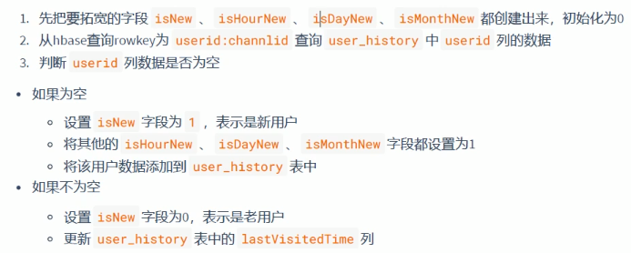


user_history 表的列
- 用户ID：频道ID(rowkey)
- 用户ID（userID）
- 频道ID（channelid）
- 最后访问时间（时间戳）（lastVisitedTime）

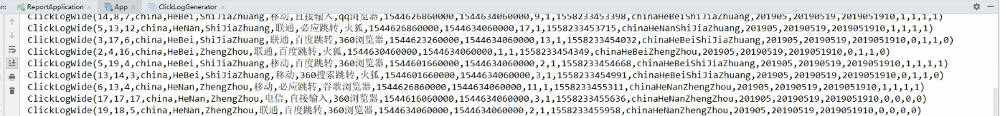


### 11、实时频道热点分析业务开发
#### 11.1、业务介绍
频道热点，就是要统计频道访问（点击）的数量。
分析得到以下的数据:
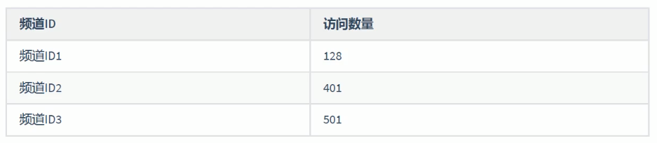

> 需要将历史的点击数据进行累加

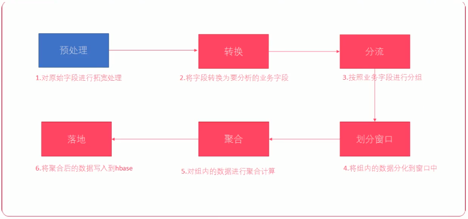

其中， 第一步预处理已经完成。

```scala
    //  转换
    ChannelRealHotTask.process(clickLogWideDateStream).print()
```


落地 HBase
```scala
    //  落地 HBase
    ChannelRealHotTask.process(clickLogWideDateStream)
```
```
    hbase shell
    scan 'channel' 
```
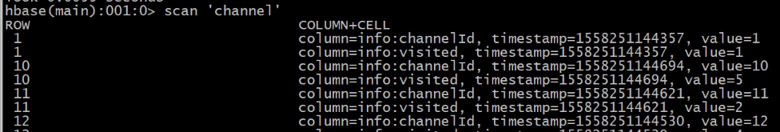


### 6、实时频道PV/UV分析
针对频道的PV、UV进行不同维度的分析，有以下三个维度：
- 小时
- 天
- 月

#### 6.1、业务介绍
PV(访问量)
即Page View，页面刷新一次计算一次

UV(独立访客)
即Unique Visitor，指定时间内相同的客户端只被计算一次

统计分析后得到的数据如下所示：
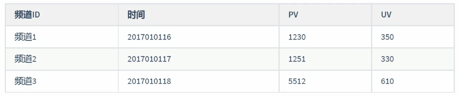


#### 6.2、小时维度PV/UV
```scala
    //  落地 HBase
    ChannelPvUvTask.process(clickLogWideDateStream)
```
```
    hbase shell
    scan 'channel_pvuv' 
```
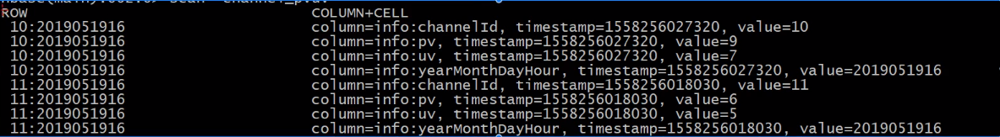


#### 6.3、天维度PV/UV业务开发

按天的维度来统计 PV、UV 与按小时维度类似，就是分组字段不一样。可以直接复制按小时维度的
 PV/UV ，然后修改就可以。
 
 

#### 6.4、小时/天/月维度PV/UV业务开发

将按**小时**、**天**、**月** 三个时间维度的数据放在一起来进行分组。

**思路**
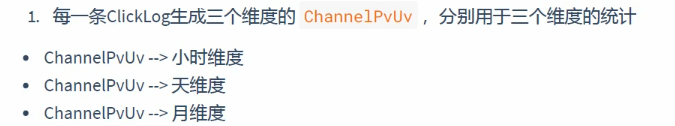

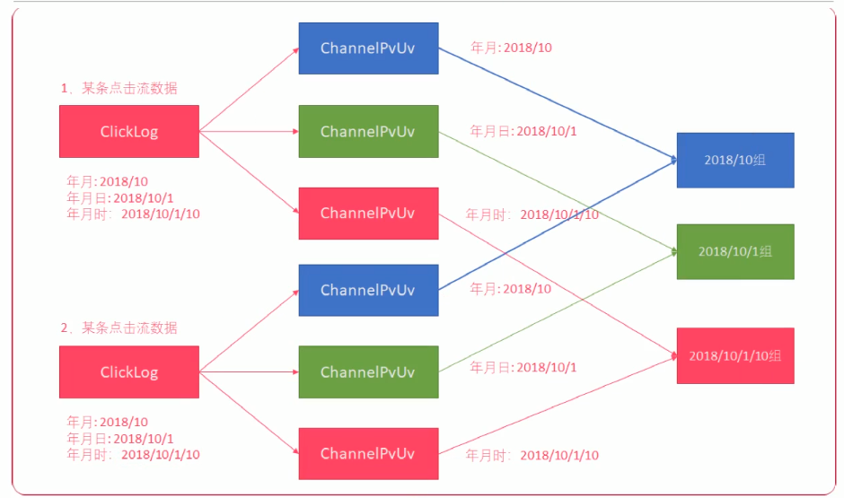

```scala
    //  落地 HBase
    ChannelPvUvTaskMerge.process(clickLogWideDateStream)
```
```
    hbase shell
    scan 'channel_pvuv' 
```
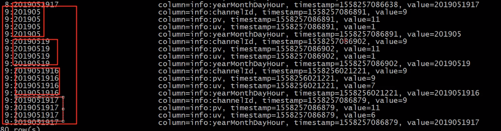


### 7、实时频道用户新鲜度分析

#### 7.1、业务介绍

用户新鲜度，即分析网站每个小时、每天、每月活跃用户的新老用户占比

可以通过新鲜度;
- 从宏观层面上了解每天的新老用户比例以及来源结构
- 当天新增用户与当天`推广行为`是否相关

统计分析要得到的数据如下：
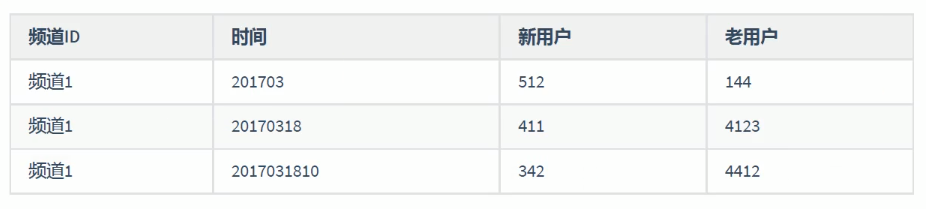

 
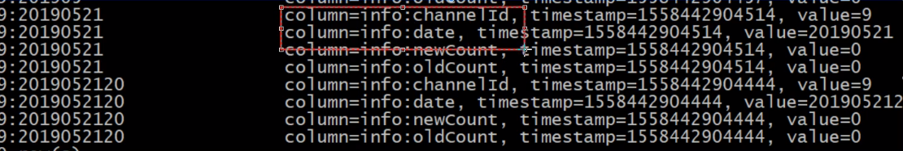


##  Day 04
### 1、模板方法提取公共类

**模板方法：**
模板方法模式是在父类中定义算法的骨架，把具体实现到子类中去，可以在不改变一个算法的结构时
可重定义该算法的某些步骤。

前面我们已经编写了三个业务的分析代码，代码结构都是分为5个部分，非常的相似。针对这样
的代码，我们可以进行优化，提取模板类，让所有的任务类都按照模板的顺序去执行。

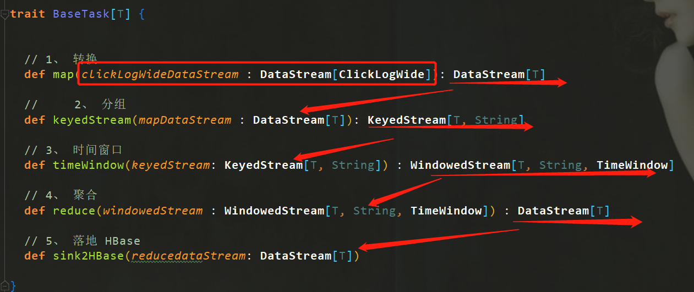


继承父类方法：
```scala
ChannelFreshnessTaskTrait.scala
```
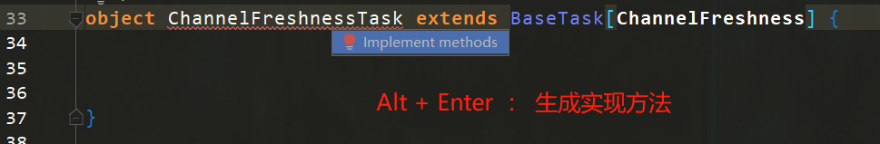


```scala
//  重构模板方法
    ChannelFreshnessTaskTrait.process(clickLogWideDateStream)
```

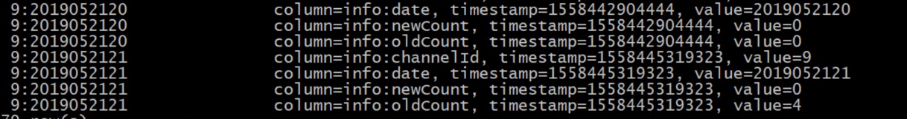
 


### 2、实时频道低于分析业务开发

#### 2.1、业务介绍
通过地域分析，可以帮助查看地域相关的PV/UV、用户新鲜度。


需要分析出来指标
- PV
- UV
- 新用户
- 老用户

统计分析后的结果如下：
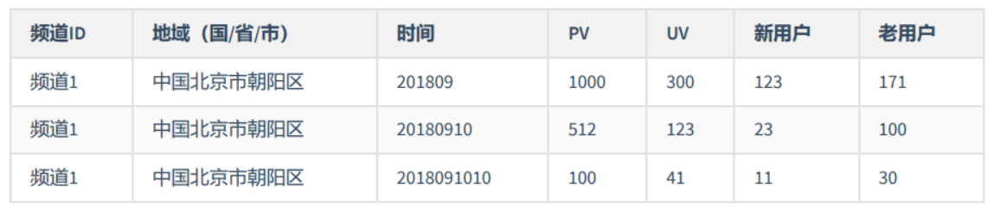


#### 2.2、 业务开发

**步骤**
1. 创建频道地域分析样例类（频道、地域（国省市）、时间、PV、UV、新用户、老用户）
2. 将预处理后的数据，使用 flatMap 转换为样例类
3. 按照 频道 、 时间 、 地域 进行分组（分流）
4. 划分时间窗口（3秒一个窗口）
5. 进行合并计数统计
6. 打印测试
7. 将计算后的数据下沉到Hbase


**实现**
1. 创建一个 ChannelAreaTask 单例对象
2. 添加一个 ChannelArea 样例类，它封装要统计的四个业务字段：频道ID（channelID）、地域（area）、日期
（date）pv、uv、新用户（newCount）、老用户（oldCount）
3. 在 ChannelAreaTask 中编写一个 process 方法，接收预处理后的 DataStream
4. 使用 flatMap 算子，将 ClickLog 对象转换为三个不同时间维度 ChannelArea
5. 按照 频道ID 、 时间 、 地域 进行分流
6. 划分时间窗口（3秒一个窗口）
7. 执行reduce合并计算
8. 打印测试
9. 将合并后的数据下沉到hbase
    - 准备hbase的表名、列族名、rowkey名、列名
    - 判断hbase中是否已经存在结果记录
    - 若存在，则获取后进行累加
    - 若不存在，则直接写入


`ChannelAreaTask`  测试
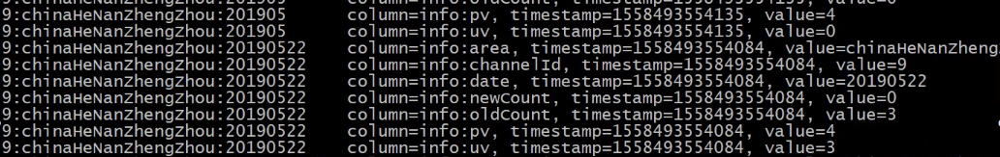


### 3、 实时运营商分析业务开发
#### 3.1、 业务介绍
根据运营商来统计相关的指标。分析出流量的主要来源是哪个运营商的，这样就可以进行较准确的网络推广。

**需要分析出来指标**
- PV
- UV
- 新用户
- 老用户

**需要分析的维度**
- 运营商
- 时间维度（时、天、月）

统计分析后的结果如下：
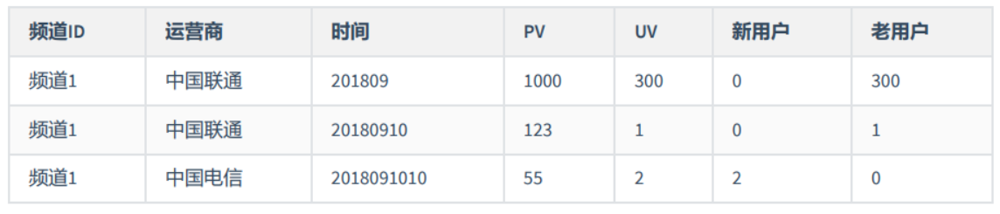


#### 3.2、 业务开发

**步骤**
1. 将预处理后的数据，转换为要分析出来数据（频道、运营商、时间、PV、UV、新用户、老用户）样例类
2. 按照 频道 、 时间 、 运营商 进行分组（分流）
3. 划分时间窗口（3秒一个窗口）
4. 进行合并计数统计
5. 打印测试
6. 将计算后的数据下沉到Hbase


**实现**
1. 创建一个 ChannelNetworkTask 单例对象
2. 添加一个 ChannelNetwork 样例类，它封装要统计的四个业务字段：频道ID（channelID）、运营商
（network）、日期（date）pv、uv、新用户（newCount）、老用户（oldCount）
3. 在 ChannelNetworkTask 中编写一个 process 方法，接收预处理后的 DataStream
4. 使用 flatMap 算子，将 ClickLog 对象转换为三个不同时间维度 ChannelNetwork
5. 按照 频道ID 、 时间 、 运营商 进行分流
6. 划分时间窗口（3秒一个窗口）
7. 执行reduce合并计算
8. 打印测试
9. 将合并后的数据下沉到hbase
    - 准备hbase的表名、列族名、rowkey名、列名
    - 判断hbase中是否已经存在结果记录
    - 若存在，则获取后进行累加
    - 若不存在，则直接写入

 `ChannelNetworkTask`  测试
报错：
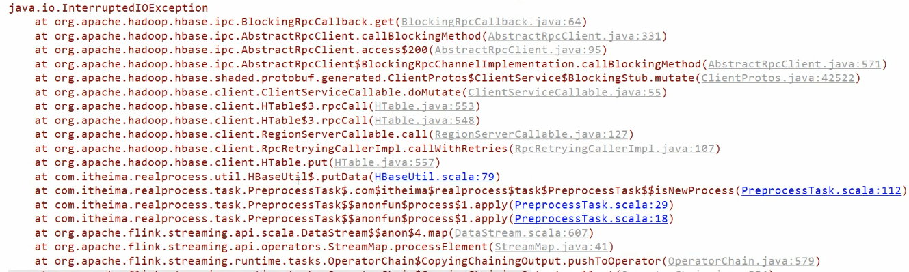

```scala
//  错误代码：
// totalPv
if (resultMap != null && resultMap.size > 0 && StringUtils.isNotBlank(resultMap(pvColName))) {
  totalPv = resultMap(pvColName).toLong + network.pv
}
else {
  totalPv = network.pv
}
...

// 正确代码： 即列空的时候写入一个 "" 空字符串 
// totalPv
if (resultMap != null && resultMap.size > 0 && StringUtils.isNotBlank(resultMap.getOrElse(pvColName,""))) {
  totalPv = resultMap(pvColName).toLong + network.pv
}
else {
  totalPv = network.pv
}

```
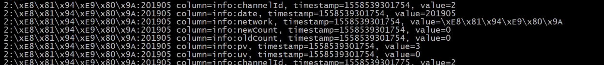


### 4、 实时频道浏览器分析业务开发

#### 4.1、 业务介绍

需要分别统计不同浏览器（或者客户端）的占比
**需要分析出来指标**
- PV
- UV
- 新用户
- 老用户

**需要分析的维度**
- 浏览器
- 时间维度（时、天、月）

统计分析后的结果如下：
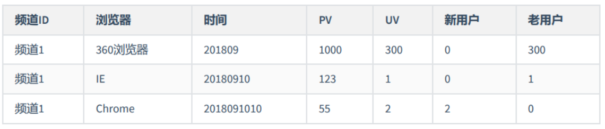


#### 4.2、 业务开发

**步骤**
1. 创建频道浏览器分析样例类（频道、浏览器、时间、PV、UV、新用户、老用户）
2. 将预处理后的数据，使用 flatMap 转换为要分析出来数据样例类
3. 按照 频道 、 时间 、 浏览器 进行分组（分流）
4. 划分时间窗口（3秒一个窗口）
5. 进行合并计数统计
6. 打印测试
7. 将计算后的数据下沉到Hbase

**实现**
1. 创建一个 ChannelBrowserTask 单例对象
2. 添加一个 ChannelBrowser 样例类，它封装要统计的四个业务字段：频道ID（channelID）、浏览器
（browser）、日期（date）pv、uv、新用户（newCount）、老用户（oldCount）
3. 在 ChannelBrowserTask 中编写一个 process 方法，接收预处理后的 DataStream
4. 使用 flatMap 算子，将 ClickLog 对象转换为三个不同时间维度 ChannelBrowser
5. 按照 频道ID 、 时间 、 浏览器 进行分流
6. 划分时间窗口（3秒一个窗口）
7. 执行reduce合并计算
8. 打印测试
9. 将合并后的数据下沉到hbase
    - 准备hbase的表名、列族名、rowkey名、列名
    - 判断hbase中是否已经存在结果记录
    - 若存在，则获取后进行累加
    - 若不存在，则直接写入


对重复使用的代码整合到`BaseTask`中进行重构

//  ChannelBrowserTask 测试
`ChannelBrowserTask.process(clickLogWideDateStream)`

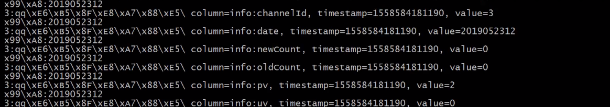


5.2.4、 canal 解决方案三

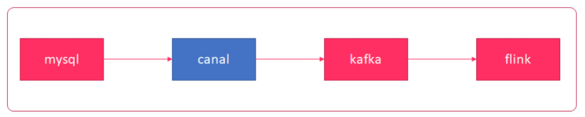

1. 通过 canal 来解析mysql中的 binlog 日志来获取数据
2. 不需要使用sql 查询mysql，不会增加mysql的压力

> binlog : mysql 的日志文件，手动开启，二进制文件，增删改命令

1. 通过 canal 来解析mysql中的 binlog 日志来获取数据
2. 不需要使用sql 查询mysql，不会增加mysql的压力


> MySQL 的主从复制，因为 canal 为伪装成 MySQL 的一个从节点，
这样才能获取到 bilog 文件


### 6、Canal数据采集平台

接下来我们去搭建Canal的数据采集平台，它是去操作Canal获取MySql的binlog文件，解析之后再把数据存入到Kafka
中。

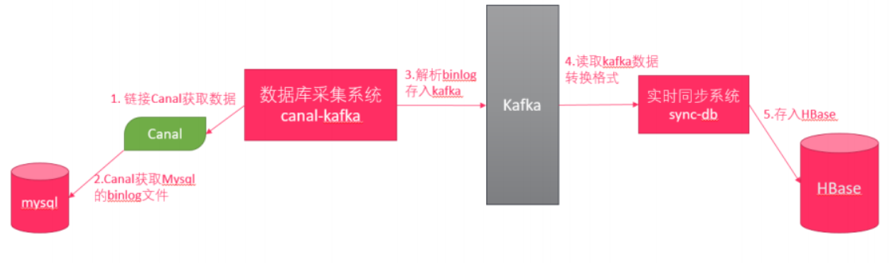


**学习顺序：**
- 安装MySql
- 开启binlog
- 安装canal
- 搭建采集系统


#### 6.1、 MySql安装


#### 6.2、 MySql创建测试表


**步骤**
1. 创建 pyg 数据库
2. 创建数据库表

**实现**
推荐使用 sqlyog 来创建数据库、创建表
1. 创建 pyg 数据库
2. 将 资料\mysql脚本\ 下的 创建表.sql 贴入到sqlyog中执行，创建数据库表


#### 6.3、 binlog 日志介绍


- 用来记录mysql中的 增加 、 删除 、 修改 操作
- select操作 不会 保存到binlog中
- 必须要 打开 mysql中的binlog功能，才会生成binlog日志
- binlog日志就是一系列的二进制文件

```
-rw-rw---- 1 mysql mysql 669 11⽉11日 10 21:29 mysql-bin.000001
-rw-rw---- 1 mysql mysql 126 11⽉11日 10 22:06 mysql-bin.000002
-rw-rw---- 1 mysql mysql 11799 11⽉11日 15 18:17 mysql-bin.00000

```

#### 6.4、 开启 binlog
步骤
1. 修改mysql配置文件，添加binlog支持
2. 重启mysql，查看binlog是否配置成功
实现
1. 使用vi打开 /etc/my.cnf
2. 添加以下配置

```
[mysqld]
log-bin=/var/lib/mysql/mysql-bin
binlog-format=ROW
server_id=1
```


> 注释说明
>   配置binlog日志的存放路径为/var/lib/mysql目录，文件以mysql-bin开头 log-bin=/var/lib/mysql/mysql-bin
>   配置mysql中每一行记录的变化都会详细记录下来 binlog-format=ROW
>   配置当前机器器的服务ID（如果是mysql集群，不能重复） server_id=1


3. 重启mysql
`service mysqld restart`
或
`systemctl restart mysqld.service`

4. mysql -u root -p 登录到mysql，执行以下命令
`show variables like '%log_bin%';`


5. mysql输出以下内容，表示binlog已经成功开启
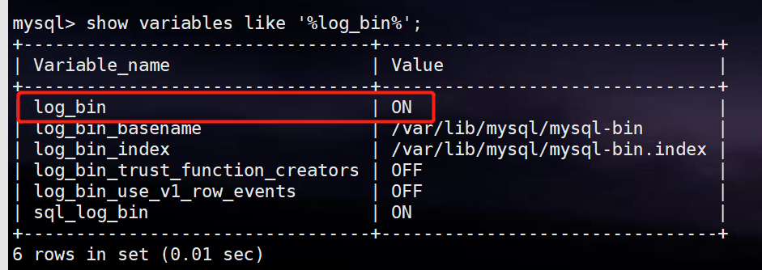


6. 进入到 /var/lib/mysql 可以查看到mysql-bin.000001文件已经生成


### 6.5. 安装Canal

#### 6.5.1. Canal介绍
- canal是 阿里巴巴 的一个使用Java开发的开源项目
- 它是专门用来进行 数据库同步 的
- 目前支持 mysql 、以及(mariaDB)

> MariaDB数据库管理系统是MySQL的一个分支，主要由开源社区在维护，采用GPL授权许可 MariaDB的目的是完
  全兼容MySQL，包括API和命令行，使之能轻松成为MySQL的代替品。


#### 6.5.2. MySql主从复制原理
mysql主从复制用途
- 实时灾备，用于故障切换
- 读写分离，提供查询服务
- 备份，避免影响业务

主从形式
- 一主一从
- 一主多从--扩展系统读取性能
> 一主一从和一主多从是最常见的主从架构，实施起来简单并且有效，不仅可以实现HA，而且还能读写分离，进而提升集群
  的并发能力。
- 多主一从--5.7开始支持
> 多主一从可以将多个mysql数据库备份到一台存储性能比较好的服务器上。
- 主主复制
> 双主复制，也就是互做主从复制，每个master既是master，又是另外一台服务器的slave。这样任何一方所做的变更，
  都会通过复制应用到另外一方的数据库中。
- 联级复制
> 级联复制模式下，部分slave的数据同步不连接主节点，而是连接从节点。因为如果主节点有太多的从节点，就会损耗一
  部分性能用于replication，那么我们可以让3~5个从节点连接主节点，其它从节点作为二级或者三级与从节点连接，这
  样不仅可以缓解主节点的压力，并且对数据一致性没有负面影响。


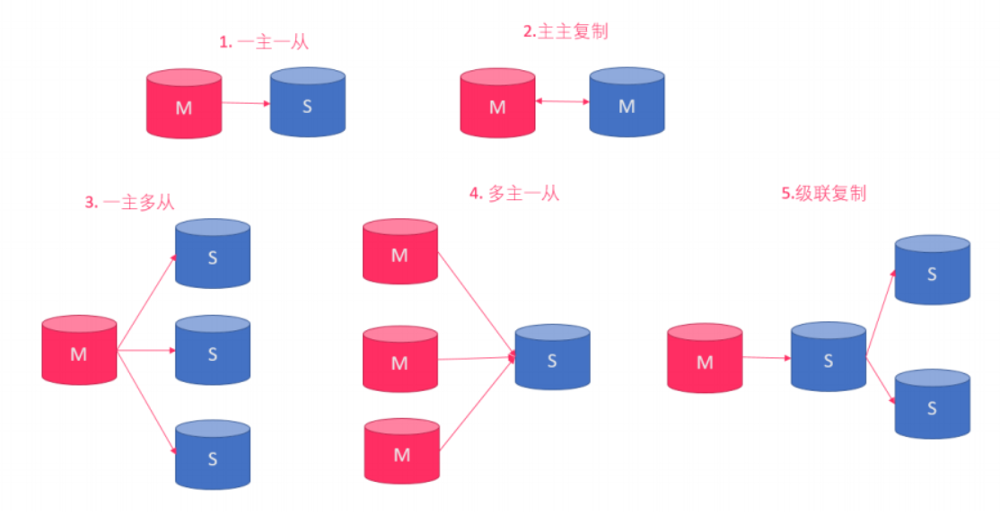


主从部署必要条件：
- 主库开启 binlog 日志
- 主从 server-id 不同
- 从库服务器能连通主库

主从复制原理图:
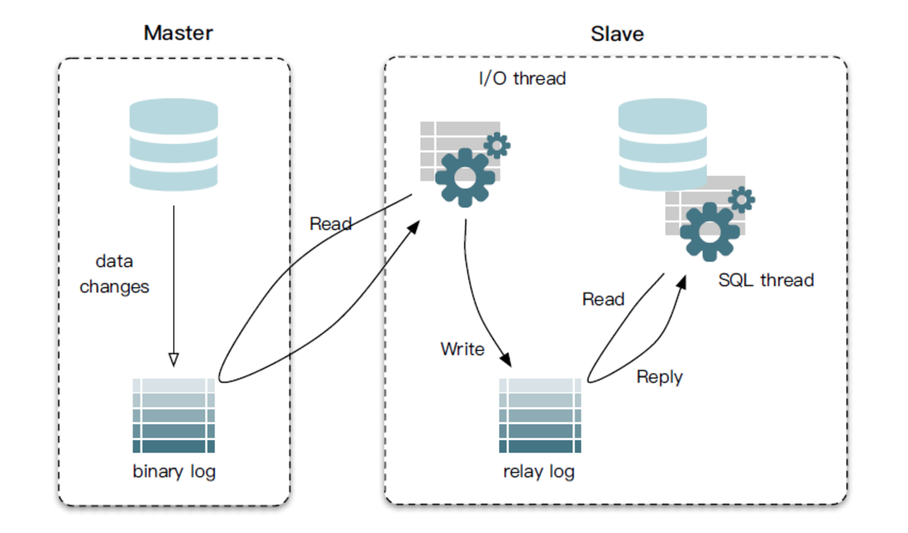

1. master 将改变记录到二进制日志( binary log )中（这些记录叫做二进制日志事件， binary log
events ，可以通过 show binlog events 进行查看）；
2. slave 的I/O线程去请求主库的binlog，拷贝到它的中继日志( relay log )；
3. master 会生成一个 log dump 线程，用来给从库I/O线程传输binlog；
4. slave重做中继日志中的事件，将改变反映它自己的数据。


#### 6.5.3. Canal原理
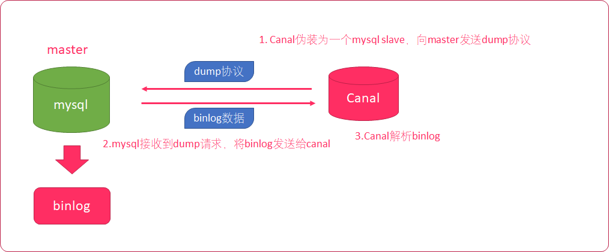


1. Canal模拟mysql slave的交互协议，伪装自己为mysql slave
2. 向mysql master发送dump协议
3. mysql master收到dump协议，发送binary log给slave（canal)
4. canal解析binary log字节流对象


#### 6.5.4. Canal架构设计
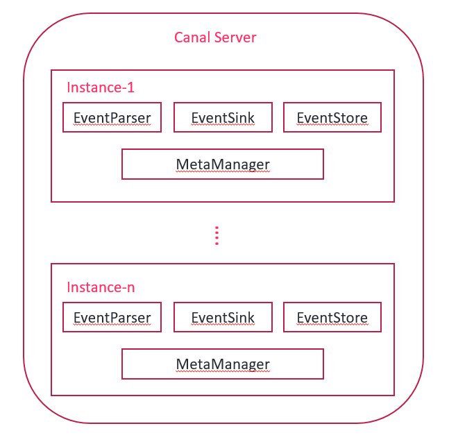

说明：
- server 代表一个canal运行实例，对应于一个jvm
- instance 对应于一个数据队列 （1个server对应1..n个instance)


instance模块（一个数据队列）：
- eventParser (数据源接入，模拟slave协议和master进行交互，协议解析)
- eventSink (Parser和Store链接器，进行数据过滤，加工，分发的工作)
- eventStore (数据存储)
- metaManager (增量订阅[读完之后，之前读过的就不再读了]&消费信息管理器)


EventParser
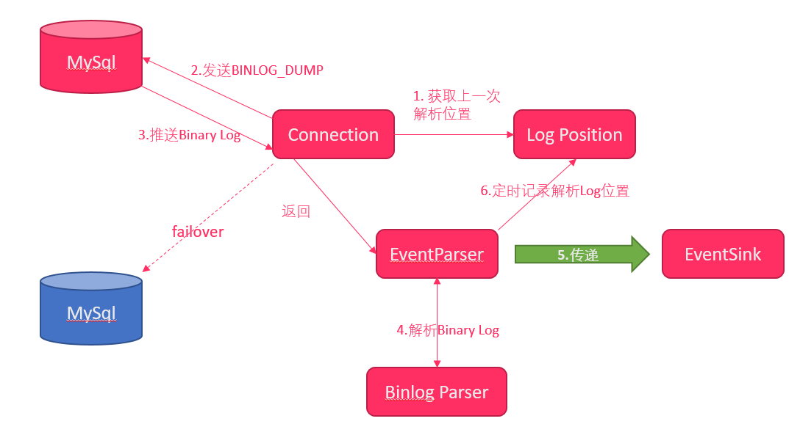

整个parser过程大致可分为六步：
1. Connection获取上一次解析成功的位置
2. Connection建立连接，发送BINLOG_DUMP命令
3. Mysql开始推送Binary Log
4. 接收到的Binary Log通过Binlog parser进行协议解析，补充一些特定信息
5. 传递给EventSink模块进行数据存储，是一个阻塞操作，直到存储成功
6. 存储成功后，定时记录Binary Log位置


EventSink设计


说明：
- 数据过滤：支持通配符的过滤模式，表名，字段内容等
- 数据路由/分发：解决1:n (1个parser对应多个store的模式)
- 数据归并：解决n:1 (多个parser对应1个store)
- 数据加工：在进入store之前进行额外的处理，比如join


EventStore设计
目前实现了Memory内存、本地file存储以及持久化到zookeeper以保障数据集群共享。 Memory内存的RingBuwer设
计：
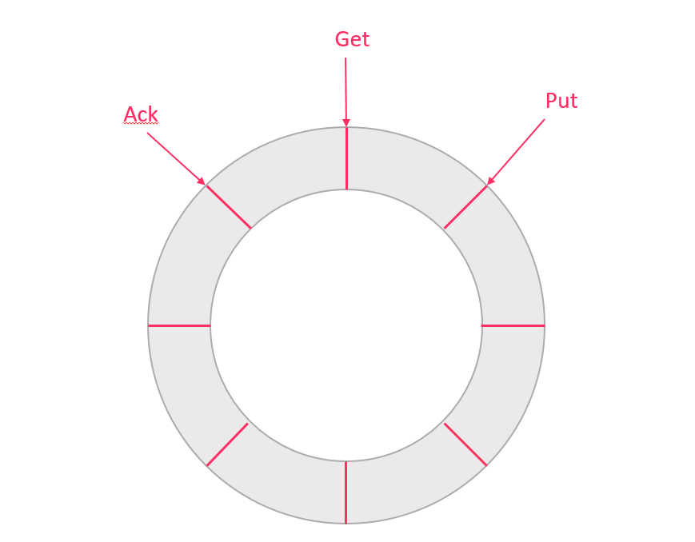


定义了3个cursor
- Put : Sink模块进行数据存储的最后一次写入位置
- Get : 数据订阅获取的最后一次提取位置
- Ack : 数据消费成功的最后一次消费位置


 #### 6.5.5. 安装Canal

**步骤**
1. 上传canal安装包
2. 解压canal
3. 配置canal
4. 启动canal


**实现**
1. 上传 \资料\软件包\canal.deployer-1.0.24.tar.gz 到 /export/software 目录
2. 在 /export/servers 下创建 canal 目录，一会直接将canal的文件解压到这个目录中
```
cd /export/servers
mkdir canal
```
3. 解压canal到 /export/servers 目录
```
tar -xvzf canal.deployer-1.0.24.tar.gz -C ../servers/canal

```
4. 修改 canal/conf/example 目录中的 instance.properties 文件
```
## mysql serverId
canal.instance.mysql.slaveId = 1234
  
# position info
canal.instance.master.address = node01:3306
canal.instance.dbUsername = root
canal.instance.dbPassword = 123456

```
> 1. canal.instance.mysql.slaveId这个ID不能与之前配置的 service_id 重复
> 2. canal.instance.master.address配置为mysql安装的机器名和端口号

5. 执行/export/servers/canal/bin目录中的 startup.sh 启动canal
> cd /export/servers/canal/bin
>  ./startup.sh

6. 控制台如果输出如下，表示canal已经启动成功
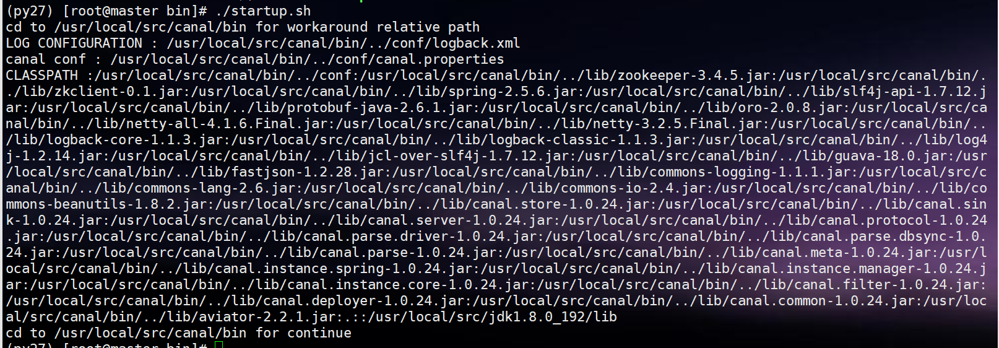
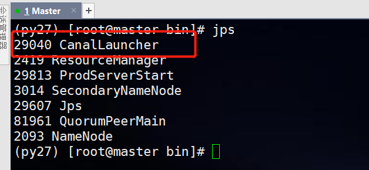


### 6.6. Canal数据采集系统 - 项目初始化

**步骤**
  1. 导入Maven依赖
  2. 拷贝 资料\工具类\03.Canal数据采集系统 中的 pom.xml 的依赖到 canal-kakfa 项目的pom.xml文件中
  3. 拷贝 资料\工具类\03.Canal数据采集系统 中的 log4j.properties 配置文件
  4. 拷贝 资料\工具类\03.Canal数据采集系统 中的 application.properties 文件


### 6.7. Canal采集程序搭建

使用java语言将canal中的binlog日志解析，并写入到Kafka中

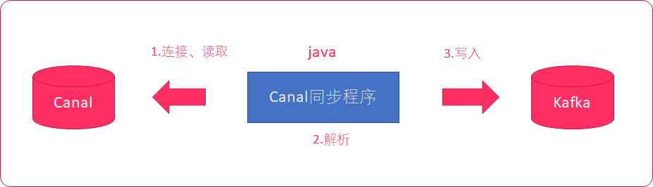

在canal-kafka项目的 java 目录中，创建以下包结构：


#### 6.7.1. 编写配置文件加载代码
**步骤**
1. 创建 GlobalConfigUtil 工具类，读取 application.properties 中的 canal 和 kafka 配置
2. 添加main方法，测试是否能正确读取配置

**实现**
1. 在 util 包中创建 GlobalConfigUtil ，用来读取 application.properties 中的配置。我们使用以下代
码来读取 application.properties 中的配置
```
ResourceBundle bundle = ResourceBundle.getBundle("配置文件名"
, Locale.ENGLISH);
String host = bundle.getString("属性key");

```
将 application.properties 中的 canal 和 kafka 配置读取出来

2. 编写main方法测试是否能够正确读取配置


GlobalConfigUtil.java
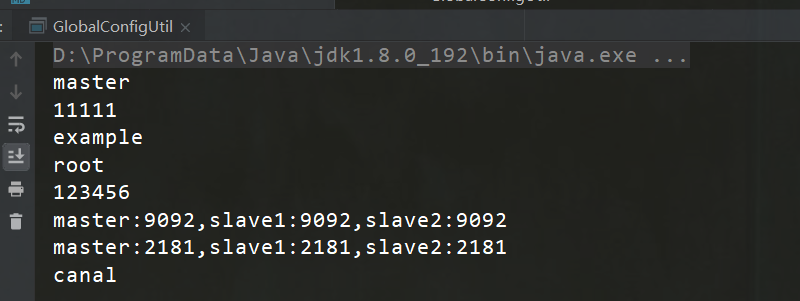


> 注意：
  使用ResourceBundle.getBundle("application", Locale.ENGLISH); 读取 application.properties 时 不需要 写
  后缀名


#### 6.7.2. 导入Kafka工具类代码
KafkaSender.java


#### 6.7.3. 导入Canal解析binlog日志工具类代码
- 将mysql中的 binlog 日志解析
- 将解析后的数据写入到 Kafka
CanalClient.java


#### 6.7.4. 测试工具类代码

**步骤**
  1. 启动 mysql
  2. 启动 canal
  3. 启动 zookeeper 集群
  4. 启动 kafka 集群
  5. 在kafka创建一个 canal topic
```
bin/kafka-topics.sh --create --zookeeper node01:2181 --replication-factor 2 --partitions 3
--topic canal

```

  6. 启动kafka的控制台消费者程序
```
bin/kafka-console-consumer.sh --zookeeper node01:2181 --from-beginning --topic canal

```


  7. 启动工具类 canal同步程序
  8. 打开 navicat ，往mysql中插入一些数据
```sql
INSERT INTO commodity(commodityId , commodityName , commodityTypeId , originalPrice , 
activityPrice) VALUES (1 , '耐克' , 1 , 888.00 , 820.00);
  
INSERT INTO commodity(commodityId , commodityName , commodityTypeId , originalPrice , 
activityPrice) VALUES (2 , '阿迪达斯' , 1 , 900.00 , 870.00);
  
INSERT INTO commodity(commodityId , commodityName , commodityTypeId , originalPrice , 
activityPrice) VALUES (3 , 'MacBook Pro' , 2 , 18000.00 , 17500.00);
  
INSERT INTO commodity(commodityId , commodityName , commodityTypeId , originalPrice , 
activityPrice) VALUES (4 , '联想' , 2 , 5500.00 , 5320.00);
  
INSERT INTO commodity(commodityId , commodityName , commodityTypeId , originalPrice , 
activityPrice) VALUES (5 , '索菲亚' , 3 , 35000.00 , 30100.00);
  
INSERT INTO commodity(commodityId , commodityName , commodityTypeId , originalPrice , 
activityPrice) VALUES (6 , '欧派' , 3 , 43000.00 , 40000.00);

```

  9. 如果kafka中能看到打印以下消息，表示canal已经正常工作
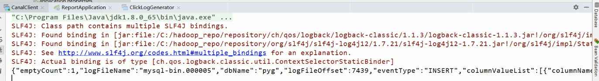


### 1. Flink实时数据同步系统开发


其中，MySQL连接Cannal，Canal操作MySQL的binlog文件。
实时同步系统Flink将Kafka中的Json数据读取过来，进行转换，存入HBase。


#### 1.1. binlog日志格式分析

测试日志数据
```json
{
    "emptyCount": 2,
    "logFileName": "mysql-bin.000002",
    "dbName": "pyg",
    "logFileOffset": 250,
    "eventType": "INSERT",
    "columnValueList": [
            {
            "columnName": "commodityId",
            "columnValue": "1",
            "isValid": "true"
            },
            {
            "columnName": "commodityName",
            "columnValue": "耐克",
            "isValid": "true"
            },
            {
            "columnName": "commodityTypeId",
            "columnValue": "1",
            "isValid": "true"
            },
            {
            "columnName": "originalPrice",
            "columnValue": "888.0",
            "isValid": "true"
            },
            {
            "columnName": "activityPrice",
            "columnValue": "820.0",
            "isValid": "true"
            }
],
    "tableName": "commodity",
    "timestamp": 1553741346000
}

```

格式分析
字段以及说明
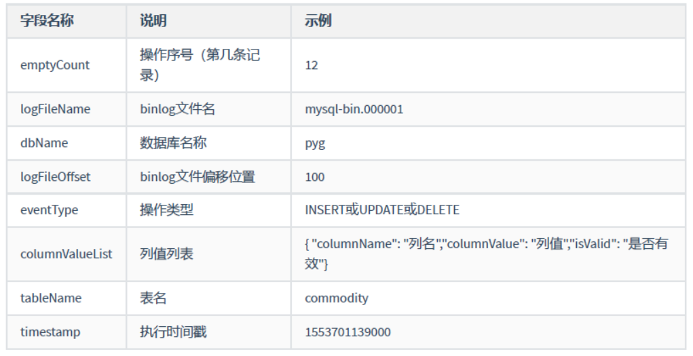


#### 1.2. Flink实时同步应用开发
整体架构

Kafka的数据来源于binlog，当Flink同步程序拿到binlog之后会进行处理和转换，然后
写入到HBase中。


具体架构


1. Flink对接Kafka
2. 对数据进行预处理（将原始样例类转换成HBase可以操作的样例类，存储到HBase）
3. 将数据落地到Hbase


数据同步说明


> 要确保hbase中的rowkey是唯一的，数据落地不能被覆盖


#### 1.3. 实时数据同步项目初始化
在sync-db项目的scala 目录中，创建以下包结构：


步骤
1. 将资料\工具类\04.Flink数据同步系统目录的pom.xml文件中的依赖导入到sync-db 项目的pom.xml
2. sync-db 模块添加scala支持
3. main和test创建scala 文件夹，并标记为源代码和测试代码目录
4. 将资料\工具类\04.Flink数据同步系统目录的application.conf 和log4j.properties 配置文件
5. 复制之前Flink项目中的GlobalConfigUtil 和HBaseUtil


#### 1.4. Flink程序开发

步骤
1. 编写App.scala ，初始化Flink环境
2. 运行Flink程序，测试是否能够消费到kafka中topic为canal 的数据
3. 编写FlinkUtils.scala

`App.scala`
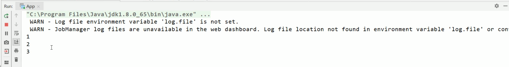

整合kafka
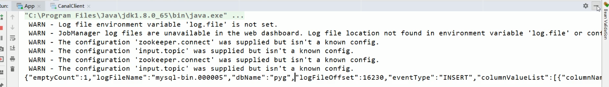


#### 1.4.1. 定义原始Canal消息样例类

步骤
1. 在bean 包下创建Canal原始消息映射样例类
2. 在Cannal样例类中编写apply方法，使用FastJSON来解析数据，转换为Cannal样例类对象
3. 编写main 方法测试是否能够成功构建样例类对象


#### 1.4.2. 解析Kafka数据流为Canal样例类

步骤
1. 在map 算子将消息转换为Canal样例类对象
2. 打印测试，如果能输出以下信息，表示成功
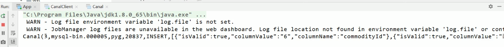


#### 1.4.3. 添加水印支持
步骤
1. 使用Canal中的timestamp 字段，生成水印数据
2. 重新运行Flink，打印添加水印后的数据
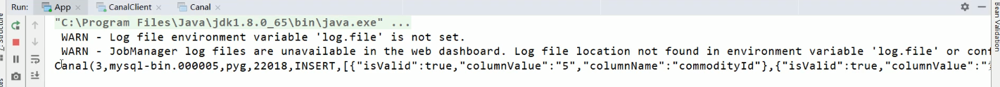


#### 1.4.4. 定义HBaseOperation样例类

HbaseOperation样例类主要封装对Hbase的操作，主要封装以下字段：
- 操作类型（opType）= INSERT/DELETE/UPDATE
- 表名（tableName）= mysql.binlog数据库名.binlog表名
- 列族名（cfName）= 固定为info
- rowkey = 唯一主键（取binlog中列数据的第一个）
- 列名（colName）= binlog中列名
- 列值（colValue）= binlog中列值


#### 1.4.5. 将Canal样例类转换为HBaseOperation样例类
一个binlog消息中，有会有多个列的操作。它们的映射关系如下：

可以使用flatMap 算子，来生成一组HBaseOperation 操作
步骤
1. 创建一个预处理任务对象
2. 使用flatMap对水印数据流转换为HBaseOperation
    - 根据eventType分别处理HBaseOperation 列表
    - 生成的表名为mysql.数据库名.表名
    - rowkey就是第一个列的值
    - INSERT操作 -> 将所有列值转换为HBaseOperation
    - UPDATE操作 -> 过滤掉isValid字段为false 的列，再转换为HBaseOperation
    - DELETE操作 -> 只生成一条DELETE的HBaseOperation的List
    - INSERT操作记录
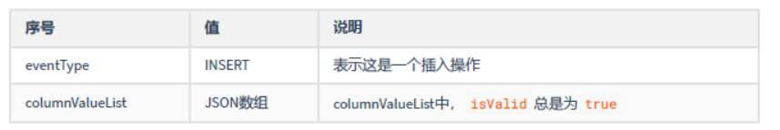


实现
1. 在task 包下创建PreprocessTask 单例对象，添加process 方法
2. 使用flatMap对Canal样例类进行扩展
3. 使用FastJSON 解析Canal样例类中的列值列表数据，并存储到一个Seq中
4. 遍历集合，构建HBaseOperation 样例类对象
5. 打印测试
6. 启动Flink验证程序是否正确处理


> JSON字符串转List
  List<T> parseArray(String text, Class<T> clazz)
  classOf[T] : 获取class对象
  Java的List转Scala的集合
  注意要导入: import scala.collection.JavaConverters._
  var scalaList: mutable.Buffer[T] = javaList.asScala
  
  
#### 1.4.6. Flink数据同步到hbase
步骤
1. 分两个落地实现，一个是delete ，一个是insert/update （因为hbase中只有一个put操作，所以只要是

2. 启动hbase

3. 启动flink 测试


#### 1.4.7. 验证Flink同步数据功能
步骤
1. 启动mysql
2. 启动canal
3. 启动zookeeper 集群
4. 启动kafka 集群
5. 启动hdfs 集群
6. 启动hbase 集群
7. 启动Flink数据同步程序
8. 启动Canal数据同步程序
9. 在mysql中执行insert、update、delete语句，查看hbase 数据是否落地


insert/update都转换为put操作）
执行插入：
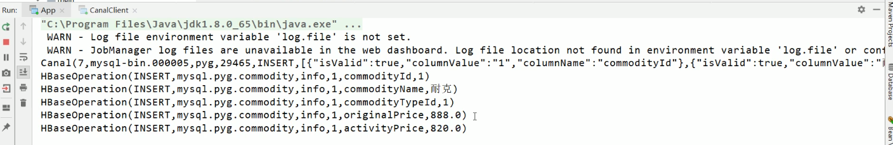
修改数据：
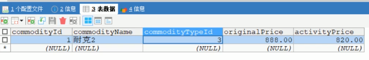
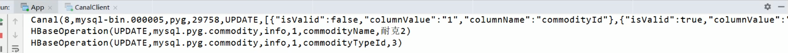

删除操作：
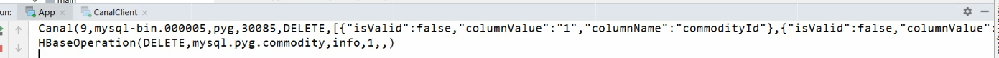


落地HBase：
删除动作：
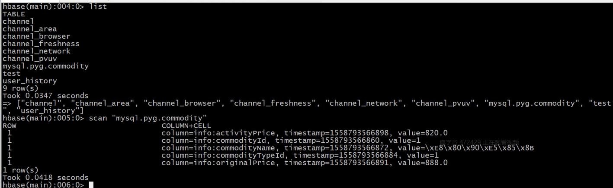


修改动作：
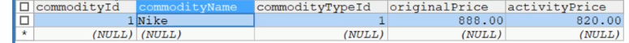
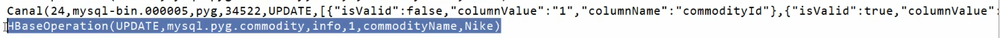

