### 4、工程结构
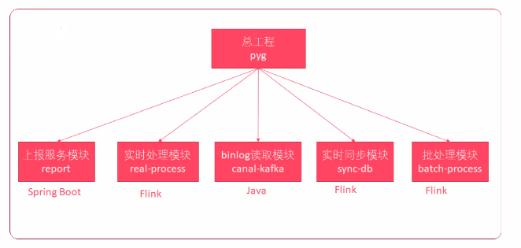

### 5、上报服务系统
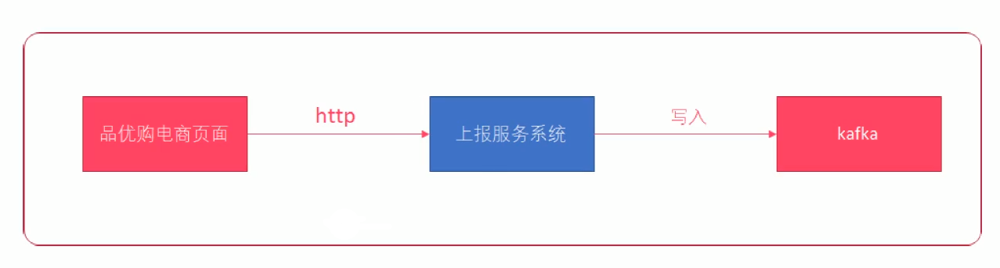
#### 5.1、Spring Boot
上报服务系统是一个 Java Web 工程，为了快速开发 web 项目，采用 JavaWeb 最流行的 Spring Boot。

Spring Boot 是一个基于 Spring 之上的快速应用快速构建框架。Spring Boot 主要解决两方面问题：

- 依赖太多问题
    - 轻量级 JavaEE 开发，需要导入大量的依赖
    - 依赖直接还存在版本冲突问题
- 配置太多问题
    - 大量的 XML 配置
    
**开发 Spring Boot 程序的基本步骤:**
   - 导入 Spring Boot 依赖（起步依赖）
   - 编写 `application.properties` 配置文件
   - 编写 `Application` 入口程序
   
#### 5.2、配置 Maven 本地仓库
#### 5.3、导入 Maven 依赖
[pom文件](/report/pom.xml)
[配置文件](/resources/application.properties)

#### 5.4、创建项目包结构

包名 | 说明
---|---
`com.henry.report.controller` | 存放 Spring MVC 的controller 
`com.henry.report.bean` | 存放相关的 Java Bean 实体类
`com.henry.report.util` | 存放相关的工具类

#### 5.5、验证 Spring Boot 工程是否创建成功
**步骤:**
1. 创建 SpringBoot 入口程序 Application
2. 创建`application.properties` 配置文件
3. 编写一个简单的`Spring MVC` Controller/Handler，接收浏览器请求参数并打印回显
4. 打开浏览器测试

**实现:**
1. 创建 SpringBoot 入口程序`ReportApplication`，用来启动 SpringBoot 程序
    - 在类上添加注解
    ```
    @SpringBootApplication
    ```
    - 在 main 方法中添加代码，用来运行 Spring Boot 程序
    ```
    SpringApplication.run(ReportApplication.class);
    ```
2. 创建一个`TestController`
    在该类上要添加注解
    ```java
    @RestController
    public class TestController{
    
    }
    ```
3. 编写一个`test Handler`
    从浏览器上接收一个名为 json 的参数，并打印显示
    ```java
    @RequestMapping("/test")
    public String test(String json){
        System.out.println(json);
        return json;
    }
    ```
 
4. 编写配置文件
    - 配置端口号
    ```properties
       server.port=8888
    ```
5. 启动 Spring Boot 程序
6. 打开浏览器测试 Handler 是否能够接收到数据

[访问连接: http://localhost:8888/test?json=666](http://localhost:8888/test?json=666)

访问结果：
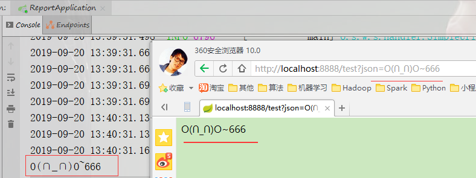

---

#### 5.6、安装 Kafka-Manager

Kafka-Manager 是 Yahool 开源的一款 Kafka 监控管理工具。

**安装步骤:**

1. 下载安装包 [Kafka-Manager下载地址](https://github.com/yahoo/kafka-manager/releases)
    
2. 解压到 `/usr/local/src/` 下
    只需要在一台机器装就可以
    ```bash
    tar -zxvf kafka-manager-1.3.3.7.tar.gz
    ```
    需要编译
   ```bash
   cd kafka-manager-1.3.3.7
   ./sbt clean dist
   ``` 
3. 修改 `conf/application.conf`
    ```bash
    kafka-manager.zkhosts="master:2181,slave1:2181,slave2:2181"
    ```  
    
4. 启动 zookeeper
    ```bash
    zkServer.sh start
    ```
5. 启动 kafka
    ```bash
    ./kafka-server-start.sh ../config/server.properties > /dev/null 2>&1 &
    ```
  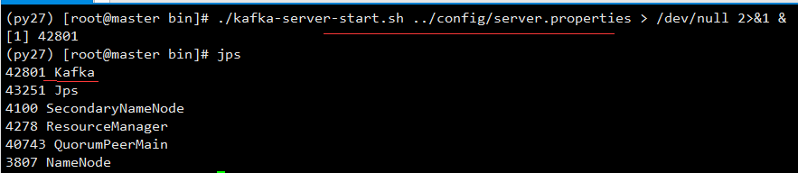


6. 启动 kafka-manager
    ```bash
    cd /usr/local/src/kafka-manager-1.3.3.17/bin
    nohup ./kafka-manager 2>&1 & # 默认启动9000 端口
    nohup ./kafka-manager 2>&1 -Dhttp.port=9900 & # 指定端口
    ``` 
  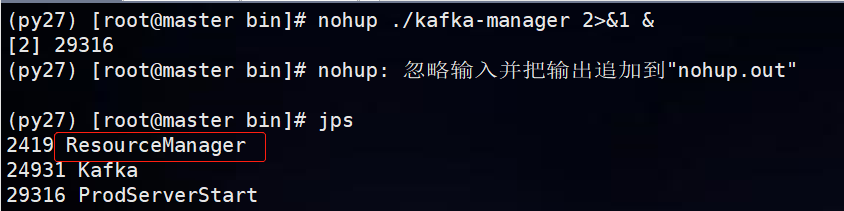
  
   页面显示：
 
   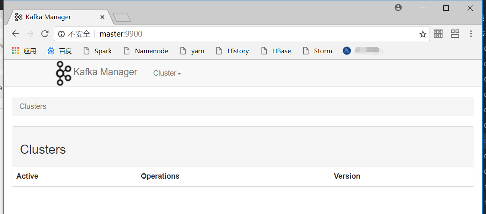
    
    
---

#### 5.7、编写 Kafka 生产者配置工具类

由于项目需要操作 Kafka，所以需要先构建出 KafkaTemplate，这是一个 Kafka 的模板对象，通过它可以很方便的发送消息到 Kafka。

**开发步骤**

1. 编写 Kafka 生产者配置
2. 编写 Kafka 生产者 SpringBoot 配置工具类 `KafkaProducerConfig`，构建 `KafkaTemplate`

**实现**

1. 导入 Kafka 生产者配置文件
	将下面的代码拷贝到`application.properties`中
	
    ```bash
    #
    # Kafka
    #
    #============编写kafka的配置文件（生产者）===============
    # kafka的服务器地址
    kafka.bootstrap_servers_config=master:9092,slave1:9092,slave2:9092
    # 如果出现发送失败的情况，允许重试的次数
    kafka.retries_config=0
    # 每个批次发送多大的数据
    kafka.batch_size=4096
    # 定时发送，达到 1ms 发送
    kafka.linger_ms_config=1
	# 缓存的大小
    kafka.buffer_memory_config=40960
	# TOPOC 名字
	kafka.topic=pyg
    ```
    
2. 编写 `kafkaTemplate`
	```java
	    @Bean   // 2、表示该对象是受 Spring 管理的一个 Bean
    public KafkaTemplate kafkaTemplate() {

        // 构建工程需要的配置
        Map<String, Object> configs = new HashMap<>();

        // 3、设置相应的配置
        // 将成员变量的值设置到Map中，在创建kafka_producer中用到
        configs.put(ProducerConfig.BOOTSTRAP_SERVERS_CONFIG, bootstrap_servers_config);
        configs.put(ProducerConfig.RETRIES_CONFIG, retries_config);
        configs.put(ProducerConfig.BATCH_SIZE_CONFIG, batch_size_config);
        configs.put(ProducerConfig.LINGER_MS_CONFIG, linger_ms_config);
        configs.put(ProducerConfig.BUFFER_MEMORY_CONFIG, buffer_memory_config);


        // 4、创建生产者工厂
        ProducerFactory<String, String> producerFactory = new DefaultKafkaProducerFactory(configs);

        // 5、再把工厂传递给Template构造方法
        // 表示需要返回一个 kafkaTemplate 对象
        return new KafkaTemplate(producerFactory);
    }
	```
	
3. 在`test`测试源码中创建一个Junit测试用例
	- 整合 Spring Boot Test
	- 注入`kafkaTemplate`
	- 测试发送100条消息到`test` Topic
	```java
	@RunWith(SpringRunner.class)
	@SpringBootTest
	public class KafkaTest {

		@Autowired
		KafkaTemplate kafkaTemplate;

		@Test
		public void sendMsg(){
			for (int i = 0; i < 100; i++)
				kafkaTemplate.send("test", "key","this is test msg") ;
			}
		
	}
	```
 
4. 在KafkaManager创建`test` topic，三个分区，两个副本
创建连接kafka集群
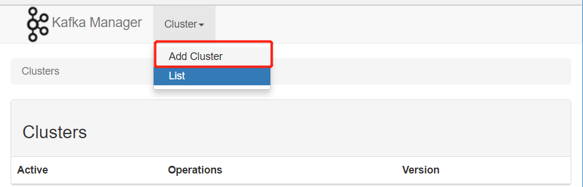
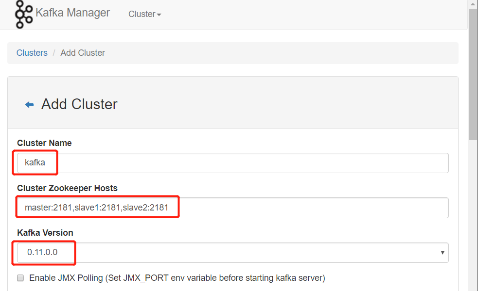
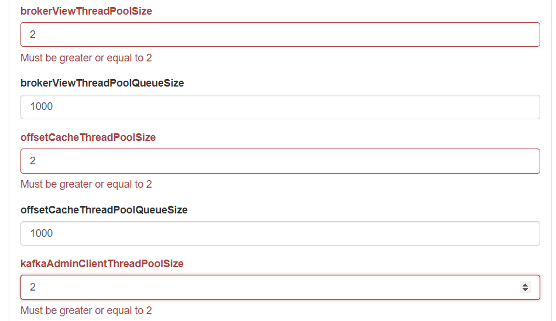
创建连接成功
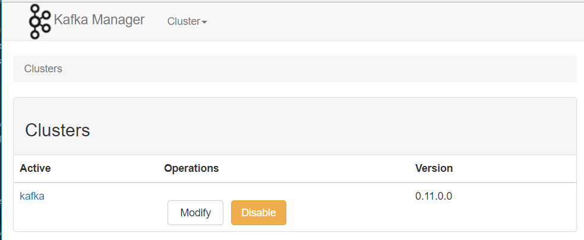
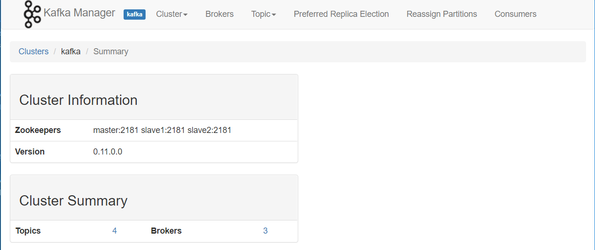
创建topic
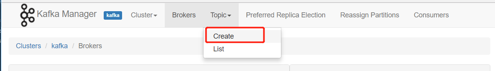

创建topic成功


    
5. 启动`kafka-conslole-consumer`
	```bash
	/usr/local/src/kafka_2.11-1.1.0/bin
	./kafka-console-consumer.sh --zookeeper master:2181 --from-beginning --topic test
	```
    运行 test 程序，报错如下：
    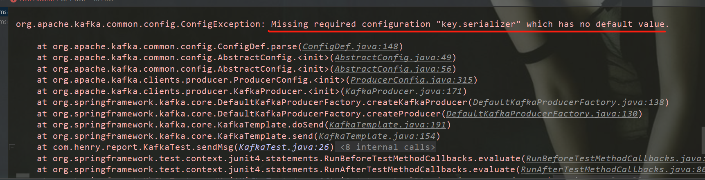
    添加序列化器代码：
    ```java
    // 设置 key、value 的序列化器
    configs.put(ProducerConfig.KEY_SERIALIZER_CLASS_CONFIG , StringSerializer.class);
    configs.put(ProducerConfig.VALUE_SERIALIZER_CLASS_CONFIG , StringSerializer.class);
    ```
   
    
6. 打开kafka-manager的consumer监控页面，查看对应的`logsize`参数，消息是否均匀的分布在不同的分区中
    添加序列化器后重新运行，消费者终端打印消息：
    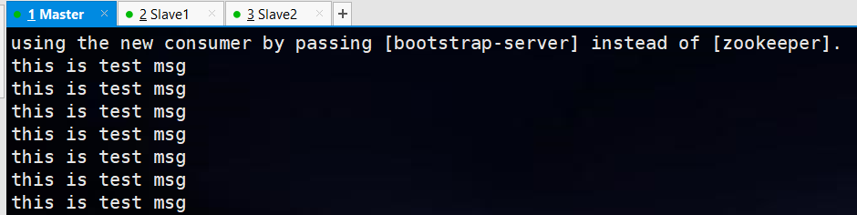
    打开页面管理：
    
    消息全落在了一个分区上，这样会影响kafka性能 
    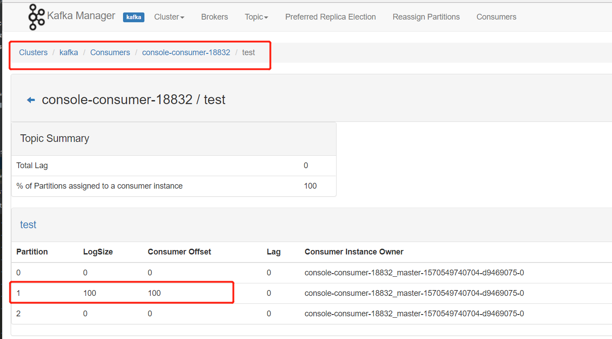
    解决的最简单的方法：将 "key" 去掉
	```java
	    @Test
    public void sendMsg(){
        for (int i = 0; i < 100; i++)
            kafkaTemplate.send("test","this is test msg") ;
			// kafkaTemplate.send("test", "key","this is test msg") ;
        }
	```
    
    
#### 5.8、自定义分区的实现

    ```java
    public int partition(String topic, Object key, byte[] keyBytes, Object value, byte[] valueBytes, Cluster cluster) {
        // 获取分区的数量
        Integer partitions =  cluster.partitionCountForTopic(topic) ;
        int curpartition = counter.incrementAndGet() % partitions ;  // 当前轮询的 partition 号
        if(counter.get() > 65535){
            counter.set(0);
        }
        return curpartition;
    }
    ```
   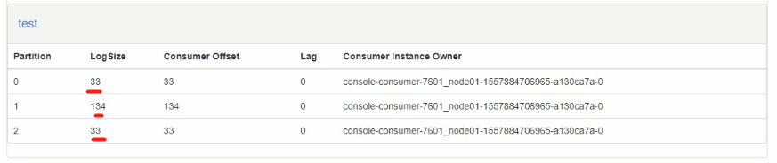 
    
    
#### 5.9、上报服务开发
    上报服务系统要能够接收 http 请求，并将 http 请求中的数据写入到 kafka 中。
   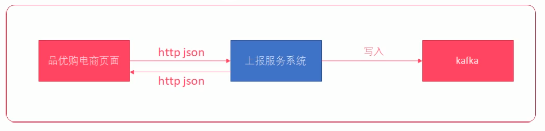
    
    步骤：
    1. 创建`Message`实体类对象
        所有的点击流消息都会封装带 Message 实体类中
    2. 设计一个 Controller 来接收 http 请求
    3. 将 http 请求发送的消息封装到一个`Message`实体类对象
    4. 使用`FastJSON`将`Message`实体类对象转换为JSON字符串
    5. 将JSON字符串使用`KafkaTemplate`写入到`kafka`
    6. 返回给客户端一个写入结果JSON字符串
 
 #### 5.10、模拟生产点击流日志消息到Kafka
    为了方便调试，可以使用一个消息生成工具来生产点击流日志，然后发送个上报服务系统。该消息生成工具可以一次性生产100条
    Clicklog 信息，并转换成 JSON ，通过 HTTPClient 把消息内容发送到编写的 ReportController 上。
   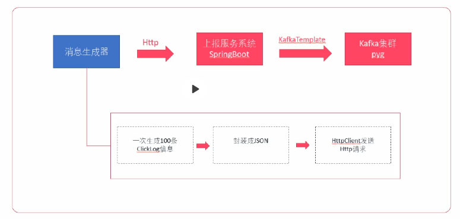
    
   步骤：
   1. 导入 ClickLog 实体类（ClickLog.java)
   2. 导入点击流日志生成器（ClickLogGenerator.java)
   3. 创建 Kafka 的 Topic（pyg）
   4. 使用 `kafka-console-sonsumer.sh` 消费 topic 中的数据
   5. 启动上报服务
   6. 执行 `ClickLogGenerator`的main方法，生成 100 条用户浏览数据消息发送到 Kafka
   
   实现：
   1. 创建 kafka topic
   ```jshelllanguage
    ./kafka-topics.sh --create --zookeeper master:2181 --replication-factor 2 --partitions 3 --topic pyg
```
   2. 启动消费者
   ```jshelllanguage
    ./kafka-console-consumer.sh --zookeeper master:2181 --from-beginning --topic pyg
```

   运行消息模拟器，运行结果如下（此时，上报服务也是在运行中）：
  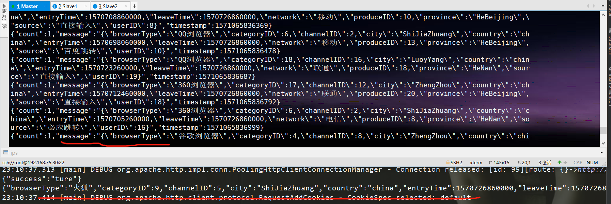
    
    
### 6、Flink 实时数据分析系统开发
   前边已经开发完成了`上报服务系统`，可以通过上报服务系统把电商页面中的点击流数据发送到 Kafka 中。那么，接下来就是开发
   `Flink 实时分析系统`，通过流的方式读取 kafka 中的消息，进而分析数据。
   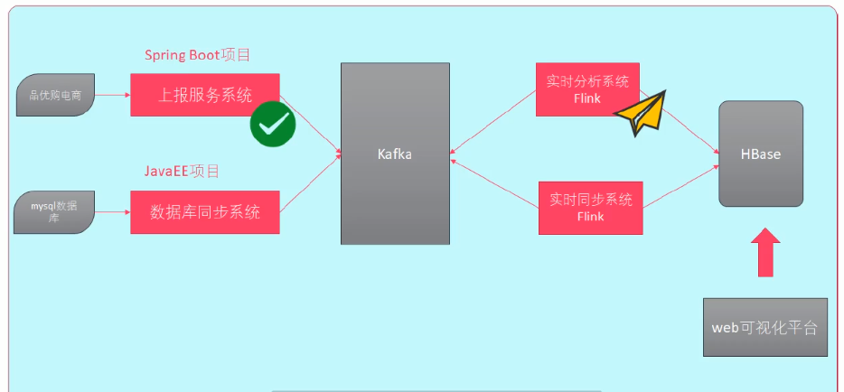
   
   **业务**
   - 实时分析频道热点
   - 实时分析频道PV/UV
   - 实时分析频道新鲜度
   - 实时分析频道地域分布
   - 实时分析运营商平台
   - 实时分析浏览器类型
   
   
   **技术**
   - Flink 实时处理算子
   - 使用`CheckPoint`和`水印`解决Flink生产中遇到的问题（网络延迟、丢数据）
   - Flink整合Kafka
   - Flink整合HBase
   
#### 6.1、搭建 Flink 实时数据分析系统 环境

##### 6.1.1 导入Maven项目依赖   

##### 6.1.2 创建项目包结构
包名 | 说明
---|---
`com.henry.realprocess.util` | 存放存放相关的工具类
`com.henry.realprocess.bean` | 存放相关的实体类
`com.henry.realprocess.task` | 存放具体的分析任务，每一个业务都是一个任务，对应的分析处理都写在这里
 
 
##### 6.1.3 导入实时系统Kafka/Hbase配置
 
1. 将`application.conf`导入到`resources`目录
2. 将`log4j.properties`导入到`resources`目录

> 注意修改`kafka服务器` 和`hbase服务器` 的机器名称

##### 6.1.4 获取配置文件API介绍
`ConfigFactory.load()`介绍
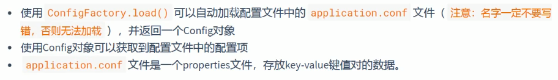

常用 API 
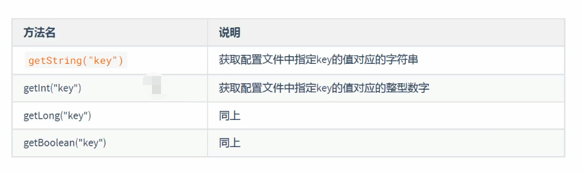
  
##### 6.1.5 编写 Scala 读取代码配置工具类
`com.henry.realprocess.util.GlobalConfigutil`
  
#### 6.2 初始化Flink流式计算环境
`com.henry.realprocess.App`


#### 6.3 Flink添加checkPoint容错支持

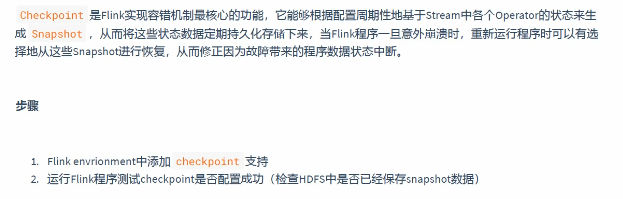
增量更新的，不会因为创建了很多状态的快照，导致快照数据很庞大，存储到HDFS中。

**实现**：

1. 在Flink流式处理环境中，添加一下`checkpoint`的支持，确保Flink的高容错性，数据不丢失。
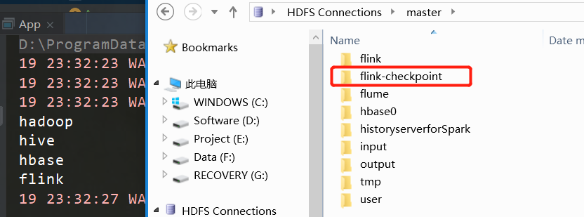


#### 6.4 Flink整合Kafka
##### 6.4.1 Flink读取Kafka数据
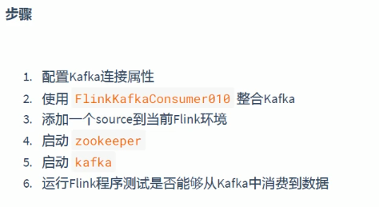

**实现**：

1、启动上报服务系统 `ReportApplication`
2、启动kafka
3、启动kafka消息生成模拟器
4、启动App.scala

消息生成模拟器发送的消息：
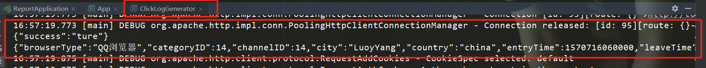
App实时分析系统接收到的消息：
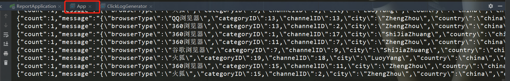
消息者接收到的消息：
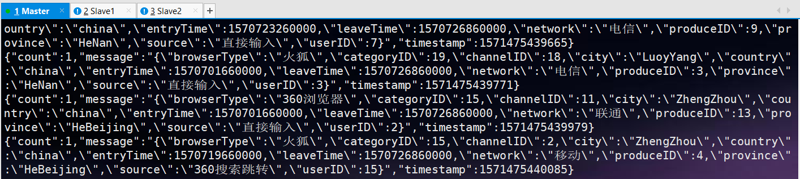


##### 6.4.2 Kafka消息解析为元组

步骤：
- 使用map算子，遍历kafka中消费到的数据
- 使用FastJSON转换为JSON对象
- 将JSON的数据解析为一个元组

代码：
1. 使用map算子，将Kafka中消费到的数据，使用FastJSON转换为JSON对象
2. 将JSON的数据解析为一个元组
3. 打印经过map映射后的元组数据，测试能否正确解析
App实时分析系统接收到的消息（Tuple类型）：
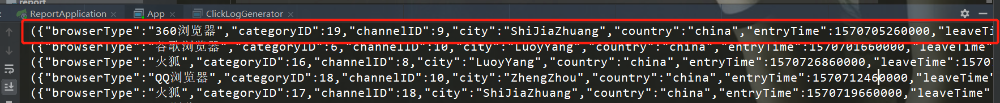
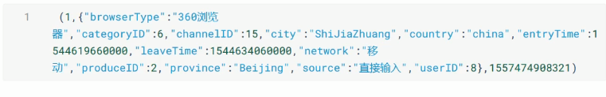


